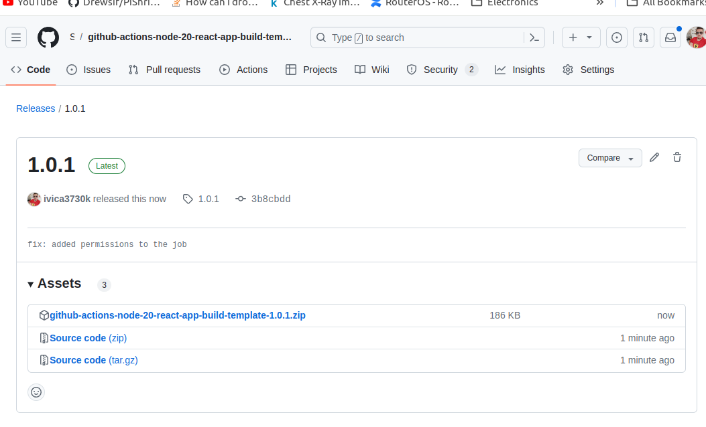

# Github actions Node 20 react app build template

This is a template repoistory set up that it builds react spa application using github actions on every new release. The build is done on ubuntu-latest runner and uses node 20. The build is done using `npm ci` and `npm run build`. In addition to saving the built output to artifact, the release is updated with the built output. The built output is saved as a zip file.



Now you can download the built output from the release page and deploy it to your server either manually or using a CI/CD tool. You can also use the github actions in this same repository to deploy the built output to your server.

Example of action that takes the release version, downloads the built output and uploads it to Azure Storage Container is shown below:

```yaml
name: Deploy selected release to prod environment on demand

on:
  workflow_dispatch:
    inputs:
      release_tag:
        description: "Release tag to deploy"
        required: true
        default: "latest"

jobs:
  deploy-release-to:
    runs-on: ubuntu-latest
    environment:
      name: PROD_ENVIRONMENT
    env:
      GH_TOKEN: ${{ secrets.GITHUB_TOKEN }}
    steps:
      - uses: actions/checkout@v4
        name: Checkout repository
      - name: Download zip from release
        run: gh release download ${{ github.event.inputs.release_tag }} -p ${{ github.event.repository.name }}-${{ github.event.inputs.release_tag }}.zip
      - name: Unzip artifact
        run: unzip ${{ github.event.repository.name }}-${{ github.event.inputs.release_tag }}.zip
      - name: Show the content of the artifact
        run: ls -la dist
      - name: Deploy to prod
        run: echo "Deploying ${{ github.event.repository.name }}-${{ github.event.inputs.release_tag }} to prod environment"
      - name: Upload dist folder to azure storage account
        uses: bacongobbler/azure-blob-storage-upload@main
        with:
          connection_string: ${{ secrets.AZURE_STORAGE_ACCOUNT_CONNECTION_STRING }}
          container_name: $web
          source_dir: dist
          overwrite: "true"
```

The build is currently building one version of the code with no environment variables, but in case you need multiple distibutions with different set of environment variables (i.e. staging backend vs production backend), you can add multiple jobs in the workflow file and use different environments with variables for each job.

# Getting Started with Create React App

This project was bootstrapped with [Create React App](https://github.com/facebook/create-react-app).

## Available Scripts

In the project directory, you can run:

### `npm start`

Runs the app in the development mode.\
Open [http://localhost:3000](http://localhost:3000) to view it in your browser.

The page will reload when you make changes.\
You may also see any lint errors in the console.

### `npm test`

Launches the test runner in the interactive watch mode.\
See the section about [running tests](https://facebook.github.io/create-react-app/docs/running-tests) for more information.

### `npm run build`

Builds the app for production to the `build` folder.\
It correctly bundles React in production mode and optimizes the build for the best performance.

The build is minified and the filenames include the hashes.\
Your app is ready to be deployed!

See the section about [deployment](https://facebook.github.io/create-react-app/docs/deployment) for more information.

### `npm run eject`

**Note: this is a one-way operation. Once you `eject`, you can't go back!**

If you aren't satisfied with the build tool and configuration choices, you can `eject` at any time. This command will remove the single build dependency from your project.

Instead, it will copy all the configuration files and the transitive dependencies (webpack, Babel, ESLint, etc) right into your project so you have full control over them. All of the commands except `eject` will still work, but they will point to the copied scripts so you can tweak them. At this point you're on your own.

You don't have to ever use `eject`. The curated feature set is suitable for small and middle deployments, and you shouldn't feel obligated to use this feature. However we understand that this tool wouldn't be useful if you couldn't customize it when you are ready for it.

## Learn More

You can learn more in the [Create React App documentation](https://facebook.github.io/create-react-app/docs/getting-started).

To learn React, check out the [React documentation](https://reactjs.org/).

### Code Splitting

This section has moved here: [https://facebook.github.io/create-react-app/docs/code-splitting](https://facebook.github.io/create-react-app/docs/code-splitting)

### Analyzing the Bundle Size

This section has moved here: [https://facebook.github.io/create-react-app/docs/analyzing-the-bundle-size](https://facebook.github.io/create-react-app/docs/analyzing-the-bundle-size)

### Making a Progressive Web App

This section has moved here: [https://facebook.github.io/create-react-app/docs/making-a-progressive-web-app](https://facebook.github.io/create-react-app/docs/making-a-progressive-web-app)

### Advanced Configuration

This section has moved here: [https://facebook.github.io/create-react-app/docs/advanced-configuration](https://facebook.github.io/create-react-app/docs/advanced-configuration)

### Deployment

This section has moved here: [https://facebook.github.io/create-react-app/docs/deployment](https://facebook.github.io/create-react-app/docs/deployment)

### `npm run build` fails to minify

This section has moved here: [https://facebook.github.io/create-react-app/docs/troubleshooting#npm-run-build-fails-to-minify](https://facebook.github.io/create-react-app/docs/troubleshooting#npm-run-build-fails-to-minify)
